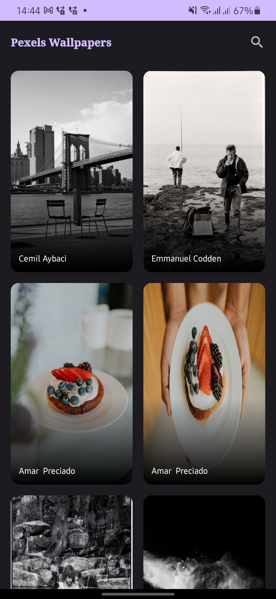
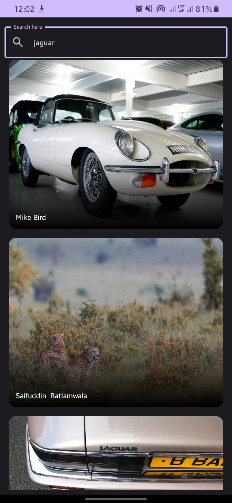
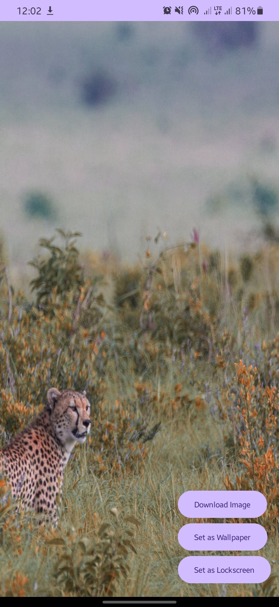

- An image-browsing application that consumes the [Pexels API](https://www.pexels.com/api/).
- Download the 
## Demo





## Features
- On the first screen, the application fetches images from Pexels API, paginates them and caches
  them to Room Database.
- On clicking an image, the user is presented with options to download the image, set it as the
  wallpaper, or as the lockscreen.
- There's also a search feature, which queries the Pexels API.
- Side note - I used lazy columns because lazy vertical grids were really laggy, and I somehow couldn't create a release build due to ProGuard errors

## Get Started
- Clone the repository, then open the project using Android Studio.
- Create your own [Pexels API Key](https://www.pexels.com/api/).
- In your local.properties file, declare the API_KEY in the format of "API_KEY: thisistheapikey" without the quotes. Remember to add the file to your .gitignore
- Then rebuild the projects
## Technology Stack

- [Kotlin](https://developer.android.com/kotlin) - Kotlin is a programming language that can run on
  JVM. Google has announced Kotlin as one of its officially supported programming languages in
  Android Studio; and the Android community is migrating at a pace from Java to Kotlin.
- Jetpack components:
    - [Jetpack Compose](https://developer.android.com/jetpack/compose) - Jetpack Compose is
      Android’s modern toolkit for building native UI. It simplifies and accelerates UI development
      on Android. Quickly bring your app to life with less code, powerful tools, and intuitive
      Kotlin APIs.
    - [Android KTX](https://developer.android.com/kotlin/ktx.html) - Android KTX is a set of Kotlin
      extensions that are included with Android Jetpack and other Android libraries. KTX extensions
      provide concise, idiomatic Kotlin to Jetpack, Android platform, and other APIs.
    - [Lifecycle](https://developer.android.com/topic/libraries/architecture/lifecycle) -
      Lifecycle-aware components perform actions in response to a change in the lifecycle status of
      another component, such as activities and fragments. These components help you produce
      better-organized, and often lighter-weight code, that is easier to maintain.
    - [ViewModel](https://developer.android.com/topic/libraries/architecture/viewmodel) -The
      ViewModel class is designed to store and manage UI-related data in a lifecycle conscious way.
    - [Paging 3 library](https://developer.android.com/topic/libraries/architecture/paging/v3-overview) -
      The Paging library helps you load and display pages of data from a larger dataset from local
      storage or over network. This approach allows your app to use both network bandwidth and
      system resources more efficiently.
    - [Room database](https://developer.android.com/training/data-storage/room) - The Room
      persistence library provides an abstraction layer over SQLite to allow fluent database access
      while harnessing the full power of SQLite.
    - [Compose Navigation](https://developer.android.com/jetpack/compose/navigation) - The
      Navigation component provides support for Jetpack Compose applications.
- [Kotlin Coroutines](https://developer.android.com/kotlin/coroutines) - A concurrency design
  pattern that you can use on Android to simplify code that executes asynchronously.
- [Retrofit](https://square.github.io/retrofit) - Retrofit is a REST client for Java/ Kotlin and
  Android by Square inc under Apache 2.0 license. Its a simple network library that is used for
  network transactions. By using this library we can seamlessly capture JSON response from web
  service/web API.
- [GSON](https://github.com/square/gson) - A Java serialization/deserialization library to convert Kotlin data classes into their JSON representations and vice versa.
- [Dagger Hilt](https://developer.android.com/training/dependency-injection/hilt-android) - A
  dependency injection library for Android that reduces the boilerplate of doing manual dependency
  injection in your project.
- [Logging Interceptor](https://github.com/square/okhttp/blob/master/okhttp-logging-interceptor/README.md) -
  Logs HTTP requests and response data.
- [Coil](https://coil-kt.github.io/coil/compose/)- An image loading library for Android backed by
  Kotlin Coroutines.
- [Mockito](https://site.mockito.org/) A mocking framework that is used for unit testing

### ©️ License

[MIT][license] © [Kevin Mathenge][github]

[license]: /LICENSE

[github]: https://github.com/kev87ian

```
MIT License

Copyright (c) 2023 Kevin Mathenge

Permission is hereby granted, free of charge, to any person obtaining a copy
of this software and associated documentation files (the "Software"), to deal
in the Software without restriction, including without limitation the rights
to use, copy, modify, merge, publish, distribute, sublicense, and/or sell
copies of the Software, and to permit persons to whom the Software is
furnished to do so, subject to the following conditions:

The above copyright notice and this permission notice shall be included in all
copies or substantial portions of the Software.

THE SOFTWARE IS PROVIDED "AS IS", WITHOUT WARRANTY OF ANY KIND, EXPRESS OR
IMPLIED, INCLUDING BUT NOT LIMITED TO THE WARRANTIES OF MERCHANTABILITY,
FITNESS FOR A PARTICULAR PURPOSE AND NONINFRINGEMENT. IN NO EVENT SHALL THE
AUTHORS OR COPYRIGHT HOLDERS BE LIABLE FOR ANY CLAIM, DAMAGES OR OTHER
LIABILITY, WHETHER IN AN ACTION OF CONTRACT, TORT OR OTHERWISE, ARISING FROM,
OUT OF OR IN CONNECTION WITH THE SOFTWARE OR THE USE OR OTHER DEALINGS IN THE
SOFTWARE.
```
